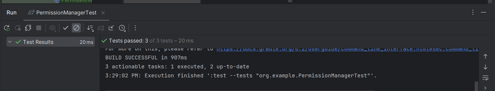
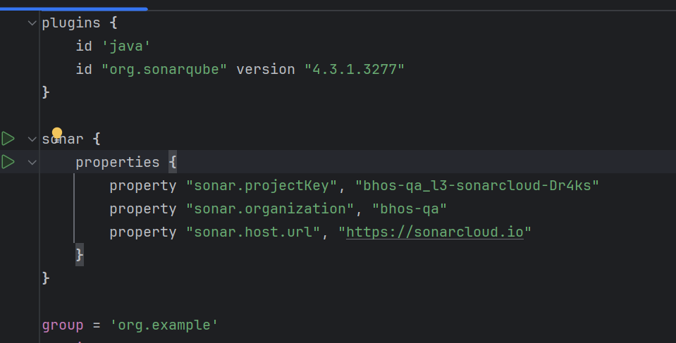
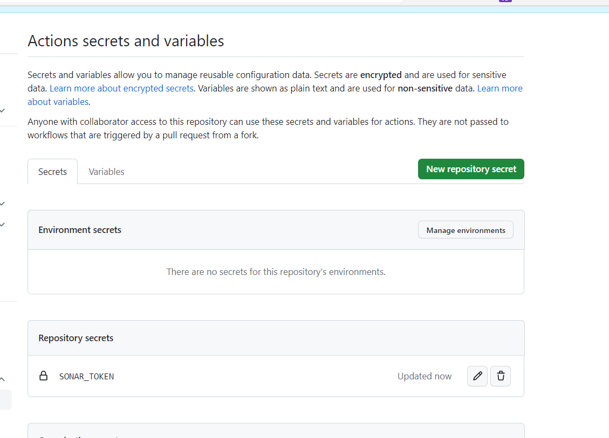
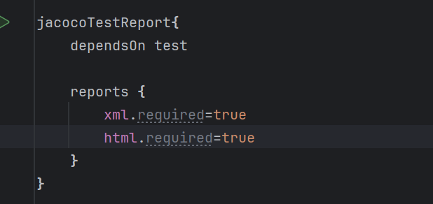

Hello, now I will do task 3.

First requirement to create branches.
```ecma script level 4
PS C:\Users\SahibHumbatzada\Desktop\Coding\QA_BHOS\lab3> git branch -a
  develop
* feature/lab3
  remotes/origin/develop
  remotes/origin/feature/lab3
  remotes/origin/main

```

We are now in 'feature/lab3' branch for our repository.

Let's add '.idea', build folders for .gitignore file.
You can look at .gitignore file from here [.gitignore file](.gitignore)

We need to create enum named 'PermissionLevel'
```java
package org.example;

public enum PermissionLevel {
    ADMIN,
    DEVELOPER,
    USER
}

```

Then, we need to create class 'PermissionManager'.
```java
public class PermissionManager {
    private PermissionLevel mCurrentLevel=PermissionLevel.USER;

    public PermissionLevel getCurrentLevel(){
        return  mCurrentLevel;
    }

    public void setPermissionLevel(PermissionLevel mCurrentLevel){
        this.mCurrentLevel=mCurrentLevel;
    }

    public String getPermissionLevelName(PermissionLevel permissionLevel){
        return switch (permissionLevel) {
            case ADMIN -> "Admin";
            case DEVELOPER -> "Developer";
            case USER -> "User";
            default -> throw new IllegalArgumentException("Invalid permission level");
        };
    }
}
```

Now, we write Unit Tests for this code
```java
package org.example;
import static org.junit.jupiter.api.Assertions.assertEquals;
import org.junit.jupiter.api.Test;
public class PermissionManagerTest {
    @Test
    public void testGetCurrentLevel(){
        PermissionManager permissionManager=new PermissionManager();

        assertEquals(PermissionLevel.USER,permissionManager.getCurrentLevel());
    }

    @Test
    public void testSetCurrentLevel(){
        PermissionManager permissionManager=new PermissionManager();

        permissionManager.setPermissionLevelName(PermissionLevel.ADMIN);

        assertEquals(PermissionLevel.ADMIN,permissionManager.getCurrentLevel());
    }

    @Test
    public void testGetPermissionLevelName(){
        PermissionManager permissionManager=new PermissionManager();

        assertEquals("Admin",permissionManager.getPermissionLevelName(PermissionLevel.ADMIN));
        assertEquals("Developer",permissionManager.getPermissionLevelName(PermissionLevel.DEVELOPER));
        assertEquals("User",permissionManager.getPermissionLevelName(PermissionLevel.USER));

    }
}
```

We check that these 3 written tests are failed or passed.



Also, we change something from build.gradle file=>


Now ,we add our environment variable into Github secrets as below.


We also integrate 'Jacoco' into our project by modifying build.gradle file like this.



