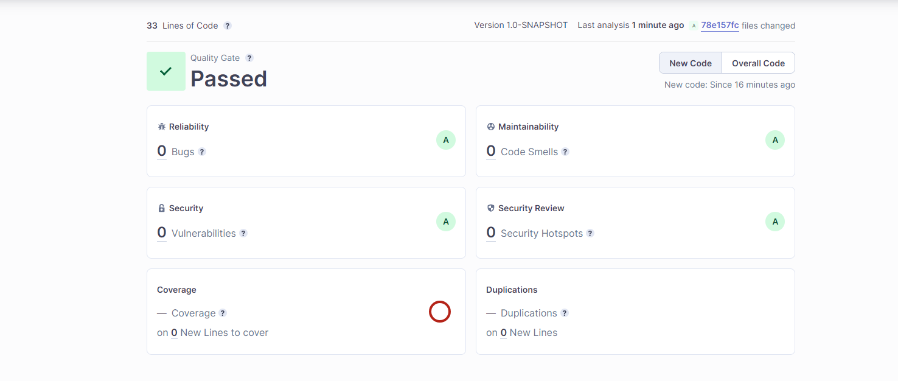

Hello, now I will do task 3.

First requirement to create branches.
```ecma script level 4
PS C:\Users\SahibHumbatzada\Desktop\Coding\QA_BHOS\lab3> git branch -a
  develop
* feature/lab3
  remotes/origin/develop
  remotes/origin/feature/lab3
  remotes/origin/main

```

We are now in 'feature/lab3' branch for our repository.

Let's add '.idea', build folders for .gitignore file.
You can look at .gitignore file from here [.gitignore file](.gitignore)

We need to create enum named 'PermissionLevel'
```java
package org.example;

public enum PermissionLevel {
    ADMIN("Admin"),
    DEVELOPER("Developer"),
    USER("User");

    final   String  name;

    PermissionLevel(String name){
        this.name=name;
    }

    public String getName(){
        return name;
    }
}

```

Then, we need to create class 'PermissionManager'.
```java
public class PermissionManager {
    private PermissionLevel mCurrentLevel=PermissionLevel.USER;

    public PermissionLevel getCurrentLevel(){
        return  mCurrentLevel;
    }

    public void setPermissionLevel(PermissionLevel mCurrentLevel){
        this.mCurrentLevel=mCurrentLevel;
    }
    
}
```

Now, we write Unit Tests for this code
```java
package org.example;
import static org.junit.jupiter.api.Assertions.assertEquals;
import org.junit.jupiter.api.Test;
public class PermissionManagerTest {
    @Test
    public void testGetCurrentLevel(){
        PermissionManager permissionManager=new PermissionManager();

        assertEquals(PermissionLevel.USER,permissionManager.getCurrentLevel());
    }

    @Test
    public void testSetCurrentLevel(){
        PermissionManager permissionManager=new PermissionManager();

        permissionManager.setPermissionLevelName(PermissionLevel.ADMIN);

        assertEquals(PermissionLevel.ADMIN,permissionManager.getCurrentLevel());
    }
    
}
```

We check that these 3 written tests are failed or passed.


Also, we change something from build.gradle file=>


Now ,we add our environment variable into Github secrets as below.


We also integrate 'Jacoco' into our project by modifying build.gradle file like this.


I created workflow as below.
```yaml
# This is a basic workflow to help you get started with Actions

name: CI

# Controls when the workflow will run
on:
  pull_request:
    branches: [ "develop" ]

  # Allows you to run this workflow manually from the Actions tab
  workflow_dispatch:

# A workflow run is made up of one or more jobs that can run sequentially or in parallel
jobs:
  # This workflow contains a single job called "build"
  build:
    # The type of runner that the job will run on
    runs-on: ubuntu-latest

    # Steps represent a sequence of tasks that will be executed as part of the job
    steps:
      # Checks-out your repository under $GITHUB_WORKSPACE, so your job can access it
      - uses: actions/checkout@v3
        with:
          fetch-depth: 0  # Shallow clones should be disabled for a better relevancy of analysis
      - name: Cache SonarCloud packages
        uses: actions/cache@v3
        with:
          path: ~/.sonar/cache
          key: ${{ runner.os }}-sonar
          restore-keys: ${{ runner.os }}-sonar
      - name: Cache Gradle packages
        uses: actions/cache@v3
        with:
          path: ~/.gradle/caches
          key: ${{ runner.os }}-gradle-${{ hashFiles('**/*.gradle') }}
          restore-keys: ${{ runner.os }}-gradle
      - name: Build and analyze
        run: chmod +x gradlew && ./gradlew build sonar --info -D sonar.quality-gate.wait=true
```

Here's what, you can also see SonarCloud analysis from [here](https://sonarcloud.io/summary/overall?id=bhos-qa_l3-sonarcloud-Dr4ks)
I also provide you with a screenshot of SonarCloud analysis.
